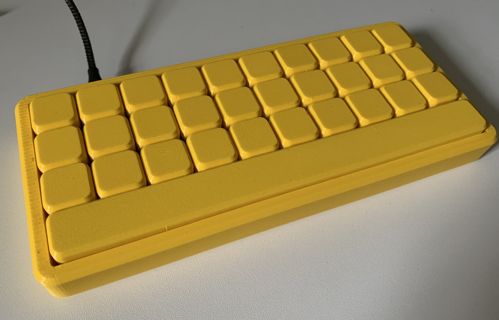
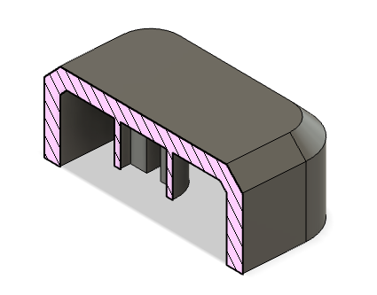
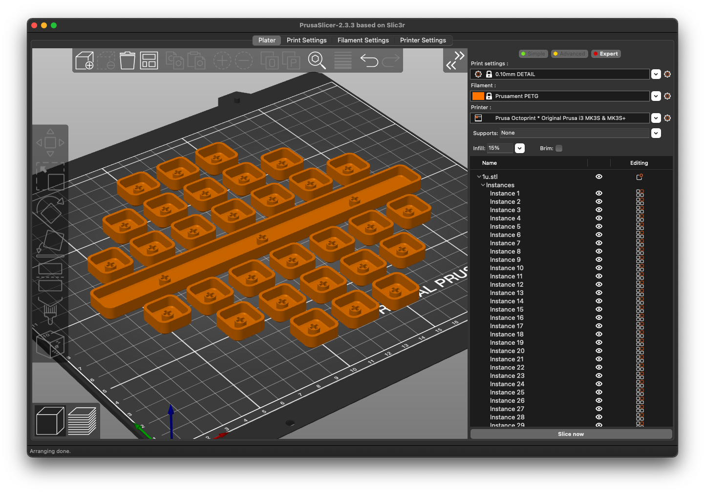

# Flat Keycaps

Flat keycaps that come out sort-of nicely on a 3D printer.

Currently only 1u and 10u sizes are provided. The 10u has a 7u stab spacing.

## Printing

I print these in PETG on a textured sheet at 0.1mm layer height. Bigger than that
starts to affect the stem. It's pretty important to print them top-down, that way
the nice texture from the bed ends up on top. The STLs are arranged that way
already.

